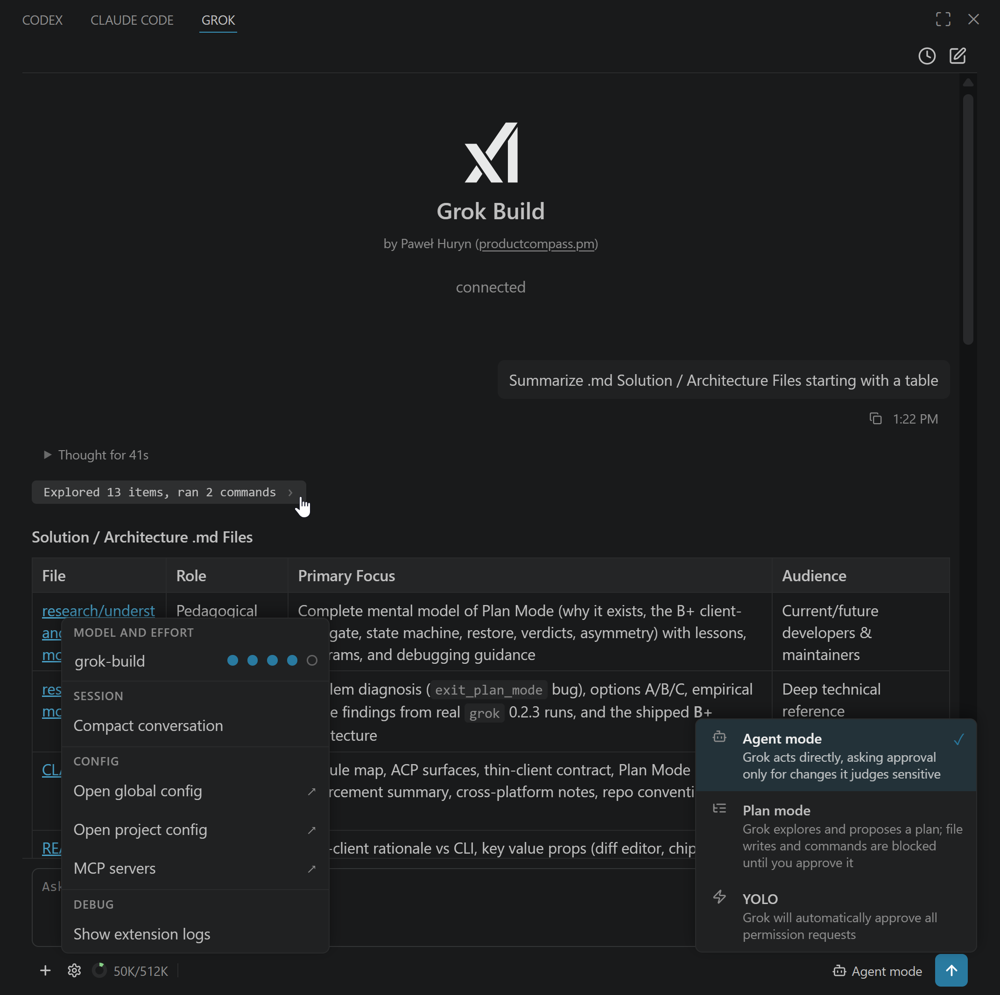
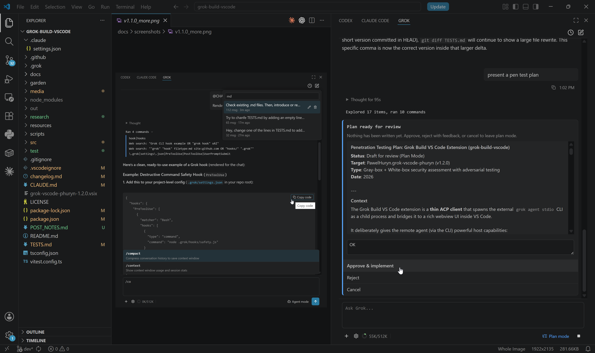

# Grok Build for VS Code

[](LICENSE) [](https://code.visualstudio.com) [](https://x.ai) [](https://www.productcompass.pm)

A thin VS Code sidebar client for xAI's Grok Build CLI. It spawns `grok agent stdio` as a headless child process and drives it over the [Agent Client Protocol (ACP)](https://agentclientprotocol.com) — all session state, MCP servers, subagents, memory, and tool execution stay inside that CLI process. Kill the extension and the `grok` child dies with it; kill `grok` and the extension shows an error and lets you start a fresh session. **Not a terminal launcher and not a re-implementation.**

Works with SuperGrok Heavy subscription or xAI API key (standard Grok). 
**Not affiliated with xAI.**





---

## Why an extension, not the CLI?

- **VS Code diff editor for proposed edits** — click "open diff →" on a permission card to see the exact change before approving
- **Active editor and selection as first-class context** — chips render as `@/path/to/file` references so the CLI reads the live file, not a paste-frozen copy
- **Permission cards** with **Allow always / Allow once / Reject** instead of `[y/N]` terminal prompts
- **Session history** — clock icon in the top bar lists past sessions (saved by the CLI in `~/.grok/sessions/`); resume, rename, or delete any of them
- **Upload from computer** — `+` button in the bottom toolbar opens a file picker; picked files are added as `@path` chips (no contents injected)
- **Webview-native streaming** — a "Thinking..." line that resolves to "Thought for *N*s"; click it to expand the full reasoning trace, plus grouped tool-call rows
- **Slash autocomplete sourced live from the CLI** via `available_commands_update` — reflects exactly what your installed version supports
- **YOLO mode toggled in-process** — no CLI restart, the session is untouched
- **Side-by-side with other AI tools** — drag the icon to the secondary side bar to sit next to Copilot Chat / Claude Code

Trade-off: this is a UI shell, not a replacement. Install the `grok` CLI first; the extension is useless without it.

---

## Quick start

> **Platforms:** macOS, Linux, and Windows. The `grok` CLI now ships a native Windows build, so the extension runs natively on all three — no WSL required. (WSL2 + Remote-WSL still works fine if you prefer it.)

**1. Install the CLI.**

macOS / Linux / WSL:

```bash
curl -fsSL https://x.ai/cli/install.sh | bash
```

Windows (PowerShell):

```powershell
irm https://x.ai/cli/install.ps1 | iex
```

**Then sign in:**

```bash
grok /login
```

`grok /login` opens a browser and completes OAuth in one step. Alternatively, get an API key at [console.x.ai](https://console.x.ai) and set `XAI_API_KEY` in your shell or a workspace `.env` (the extension auto-loads it). With a subscription you get **Grok Build**; with an API key you also get **grok-4.20** (3 variants), **grok-4.3**, and **grok-imagine** (3 options).

**2. Install the extension.**

From the VS Code Marketplace: search for **Grok Build** by *PawelHuryn*, or install from the command line:

```bash
code --install-extension PawelHuryn.grok-vscode-phuryn
```

Or build from source:

```bash
git clone https://github.com/phuryn/grok-build-vscode.git
cd grok-build-vscode
npm install
./scripts/install.sh        # Windows: pwsh scripts\install.ps1
```

Reload VS Code (**Ctrl+Shift+P → Developer: Reload Window**) and click the Grok icon in the activity bar.

> **Tip:** Right-click the Grok icon → **Move To → Secondary Side Bar** to park Grok on the right alongside other AI tools.
>
> 

**Uninstall:** `./scripts/uninstall.sh` (Windows: `pwsh scripts\uninstall.ps1`) or `code --uninstall-extension PawelHuryn.grok-vscode-phuryn`.

---

## Key concepts

### Thin client over ACP

The extension speaks JSON-RPC over `grok agent stdio`'s stdin/stdout. It implements every mandatory server→client handler (`fs/read_text_file`, `fs/write_text_file`, `terminal/{create,output,wait_for_exit,kill,release}`) — missing any of them crashes the agent mid-session.

### Where state lives

| Lives in the CLI | Lives in the extension |
|---|---|
| Conversation history, memory, `~/.grok/` | Chips list (active editor + drag-added files) |
| MCP servers, subagents, plugins | YOLO flag (auto-approval) |
| Tool execution, model state | Plan-mode gate (mirror of YOLO — workspace-write block + read-only command allowlist), per-plan verdict log |
| Plan text on disk (`~/.grok/sessions/<…>/plan.md`) | Webview UI state, popovers, slash filter, pending diff per `toolCallId` |

Restarting the session (the **+** button) kills the CLI child and spawns a fresh one. Memory persisted by the CLI in `~/.grok/` survives.

### Modes

| Mode | Behaviour |
|---|---|
| **Agent** (default) | CLI acts directly and **may** ask for permission on a write or shell action it judges sensitive — when it does, a card appears in chat |
| **YOLO** | Extension auto-responds "allow always" to any `session/request_permission` the CLI raises. The CLI process and its session are untouched, no restart |
| **Plan** | The agent drafts a plan first and *cannot* write to the workspace or run anything outside a read-only allowlist until you approve. Approve / Reject / Cancel from the chat card, each with an optional free-form comment forwarded to grok |

### File chips

The active editor file is added as an **implicit** chip automatically (toggle via `grok.includeActiveFileByDefault`). Drag from the Explorer, right-click → **Grok: Send File**, press **Alt+G**, or click the **+** button in the bottom toolbar → *Upload from computer* to add **explicit** chips. Chips are sent to the agent as `@/path/to/file` references — the CLI resolves them, so content stays current and doesn't bloat chat history. Hold **Shift** while dragging to embed the file content inline as a fenced code block instead.

### Session history

Click the clock icon in the top bar to see all sessions saved by the CLI for the current project (grok writes them to `~/.grok/sessions/<urlencoded-cwd>/`). Click a row to resume — the extension calls `session/load` and grok replays the conversation. Hover a row to rename (pencil) or delete (trash). Names default to the first message sent in that session; rename overrides live in VS Code's `globalState` and never touch grok's files.

### Permission cards with diff preview

For `kind:"edit"` tool calls, the card shows a `path — N → M lines` summary and an "open diff →" button. Clicking it opens VS Code's native diff editor against the proposed new content. Note: the actual write only happens *after* you approve, via `fs/write_text_file`. See [Known limits](#known-limits) for the v1.0 caveat on what the diff is actually diffed against.

---

## Architecture

```
VS Code webview ──postMessage──► extension host ──JSON-RPC over stdin/stdout──► grok agent stdio
                                                  ◄── session/update (message chunks, thought chunks, tool calls, mode changes)
                                                  ◄── fs/read_text_file, fs/write_text_file
                                                  ◄── terminal/create, terminal/output, terminal/wait_for_exit, terminal/kill, terminal/release
                                                  ◄── session/request_permission
                                                  ◄── x.ai/exit_plan_mode
```

### How a session starts

When the panel opens (or you click **+** for a new session):

1. Locate the `grok` binary: `grok.cliPath` setting → `~/.grok/bin/grok` → `PATH`.
2. Spawn `grok agent stdio` as a background child — visible in `ps` / Activity Monitor, never opens a terminal window.
3. Send `initialize` → `session/new` → `session/set_model` over stdio.
4. If `grok.defaultEffort` is set, forward it as `--reasoning-effort <value>` before the `stdio` subcommand (values match grok's accepted set: `none`/`minimal`/`low`/`medium`/`high`/`xhigh`).
5. Stream `session/update` notifications (messages, thoughts, tool calls, permission requests) back to the chat.

### Module map

| File | Role |
|---|---|
| [src/extension.ts](src/extension.ts) | Entry point — registers commands, keybindings, output channel |
| [src/sidebar.ts](src/sidebar.ts) | Webview provider, message routing, fs handlers, diff preview |
| [src/acp.ts](src/acp.ts) | ACP client — spawns CLI, manages session lifecycle, emits events |
| [src/acp-dispatch.ts](src/acp-dispatch.ts) | Pure protocol helpers — line parsing, update routing, response builders |
| [src/cli-locator.ts](src/cli-locator.ts) | Locate `grok` binary; cross-platform |
| [src/terminal-manager.ts](src/terminal-manager.ts) | Headless shells for the agent's `terminal/*` calls |
| [src/chips.ts](src/chips.ts) | File-chip CRUD (pure) |
| [src/prompt-builder.ts](src/prompt-builder.ts) | Chip → prompt-string with `@path` refs and fenced blocks |
| [src/slash-filter.ts](src/slash-filter.ts) | Slash-command autocomplete filter |
| [src/sessions.ts](src/sessions.ts) | Disk-driven session listing/delete + customName overrides (pure) |
| [media/chat.{js,css}](media/) | Webview UI |
| [media/webview-helpers.js](media/webview-helpers.js) | Pure webview helpers (file-ref detection, relative-time format); shared between webview and tests |

### Design choices worth knowing

- **Pure modules split for testability.** `acp-dispatch`, `chips`, `prompt-builder`, `slash-filter`, `cli-locator`, `sessions`, `webview-helpers` have no `vscode` import, no spawn, no network — they run under Vitest in a Node process. 94 tests in under two seconds.
- **YOLO is client-side only.** It's a single `autoApprove` flag in [src/sidebar.ts](src/sidebar.ts) — toggling Agent ↔ YOLO doesn't restart the CLI or even send a message. Whenever the CLI does raise a permission request, the extension just answers "allow always" automatically.
- **Cross-platform without per-OS branches.** [src/terminal-manager.ts](src/terminal-manager.ts) uses `spawn(cmd, { shell: true })` so Node picks `cmd.exe` or `/bin/sh`. [src/cli-locator.ts](src/cli-locator.ts) prefers `HOME`/`USERPROFILE` env over `os.homedir()` so tests can override paths.
- **Streaming is rAF-coalesced.** `agent_message_chunk` and `agent_thought_chunk` buffer into a raw string and re-render at most once per animation frame — keeps long responses smooth even under fast chunk rates.
- **`available_commands_update` drives slash autocomplete.** No hardcoded command list; the CLI tells the extension what's available, so plugin/skill installs surface immediately.

---

## Usage

### Sending a prompt

Type in the composer and press **Enter** (or **Ctrl/Cmd+Enter** if `grok.useCtrlEnterToSend` is on). The agent streams its response; while it reasons, a "Thinking..." line shows, which resolves to "Thought for *N*s" on completion. Click the line to expand or collapse the full reasoning trace (collapsed by default).

### Voice input (dictation)

The **microphone button** in the top-right corner of the composer dictates speech into the input box, transcribed by [xAI's Speech-to-Text API](https://docs.x.ai/developers/model-capabilities/audio/voice). Click it to start (the button turns blue and shows animated waves) and speak.

By default transcription is **live/streaming** — words appear in the composer in real time as you talk (over the STT WebSocket), and the recognized **"grok send"** command is highlighted with an accent pill as you say it. On click the mic shows a brief **"connecting…" spinner**; wait for the **blue listening waves** before speaking (that's when capture is live). Then:
- Say **"grok send"** — the message submits automatically and **the mic keeps listening**, so you can dictate the next message hands-free. You can even keep talking while Grok is responding; messages dictated mid-response are queued and sent as soon as Grok finishes. **Once you click the mic, you never need the mouse or keyboard again** until you're done.
- **Click the mic** to stop listening and keep any in-progress text (edit before sending).

The two-word send phrase is deliberate — it won't fire on a message that merely ends in "send", and it tolerates the common "send"→"sent" mishearing — and it's passed to the STT model as a bias term so it's recognized reliably. Trailing punctuation is kept on your message (and never doubled): "…today grok send?" → "…today?". Configure or disable the phrase with `grok.voiceSendPhrase`. Prefer one-shot transcription? Set `grok.voiceStreaming: false` for batch mode (click to start, click to stop, then transcribe).

Listening is scoped to the session it started in: **switching, resuming, or restarting a session stops the mic**, and after ~2 minutes of silence it auto-stops too — click to resume.

Two one-time setup steps:

1. **ffmpeg** — recording happens in the extension host (VS Code webviews can't access the microphone), via [`ffmpeg`](https://ffmpeg.org). Install it and ensure it's on `PATH`, or point `grok.ffmpegPath` at it.
2. **An xAI API key** — Speech-to-Text is a *separate* xAI product from the Grok CLI login, billed pay-as-you-go (~$0.10/hr) on its own [console.x.ai](https://console.x.ai) developer key. Set `grok.voiceApiKey`, or add `GROK_VOICE_API_KEY` (or `XAI_API_KEY`) to your workspace `.env`. Your Grok CLI login is **not** used here and a SuperGrok subscription does not grant API credit.

> Why not route audio through the Grok CLI? The CLI advertises `promptCapabilities.audio: false` and rejects audio — it's a text/code agent. So voice deliberately bypasses ACP and calls the STT API directly. See [research/voice-input.md](research/voice-input.md) for the full feasibility write-up.

#### How it works & what it costs

Recording happens in the **extension host** (an `ffmpeg` child process — the webview can't reach the mic). In streaming mode the host pipes raw PCM to xAI's STT **WebSocket** and relays the live transcript back to the composer; in batch mode it uploads the finished clip to the STT REST endpoint. STT is billed by **audio duration, not word count**: **$0.10/hour** for batch and **$0.20/hour** for streaming.

That's tiny in practice. We measured it end-to-end: a **510-word** passage taken from this project's own design discussion ([research/cost-sample.txt](research/cost-sample.txt)), synthesized to speech and transcribed, was **3.06 minutes of audio**, costing:

| Mode | Cost for ~500 words | Per 1,000 words |
|---|---|---|
| Batch ($0.10/hr) | **$0.0051** (~½¢) | ~$0.010 |
| Streaming ($0.20/hr) | **$0.0102** (~1¢) | ~$0.020 |

**How we measured it:** `research/cost-sample.txt` (510 real words) → Windows SAPI text-to-speech → `POST api.x.ai/v1/stt`; cost = the API's returned `duration` ÷ 3600 × rate. Reproduce with [research/voice-cost-probe.cjs](research/voice-cost-probe.cjs). So a heavy day of dictation — say 10,000 words — runs about **10¢**.

### Slash commands

Type `/` to open autocomplete. Commands are sourced live from the CLI — the list reflects your installed `grok` version. See [docs/SLASH-COMMANDS.md](docs/SLASH-COMMANDS.md) for a reference snapshot.

### Tool calls

Each action appears in chat:
- **Single call** — flat row: "Read sidebar.ts lines 1–120", "Edit package.json", "Run npm test"
- **Multiple calls** — collapsed group ("Read, Edit +2") that expands on click

### Reasoning effort

Click the **gear** icon → effort dots to pick a reasoning-effort level (`none` → `xhigh`). It's forwarded to the CLI as `--reasoning-effort`; changing it restarts the session (with an optional *Summarize & Restart* to carry context forward). Some subscription tiers may still reject effort at the backend.

### Model picker

Click the model name in the gear popover. The list comes from `session/new`'s response — switching is live via `session/set_model`, no restart.

### Context donut

The bottom-toolbar donut shows `usedK/maxK` tokens, updated after each prompt. When it fills, `/compact` compresses the conversation or click **+** for a fresh session.

### Gear popover

| Section | What |
|---|---|
| Model and Effort | Model picker + reasoning effort dots |
| Session | Compact conversation (sends `/compact`) |
| Config | Open global `~/.grok/config.toml`, project `.grok/config.toml`, `grok mcp list` |
| Debug | Show extension logs (every ACP message in/out) |

### MCP servers

MCP servers are configured in the CLI (`~/.grok/config.toml` global, `.grok/config.toml` project) — the extension picks up whatever the CLI loads. Add a server with the CLI:

```bash
grok mcp add playwright --command npx --args @playwright/mcp@latest
```

Or edit the config files directly via gear → *Open global config* / *Open project config*. Click the new-session button in the sidebar to reload.


---

## Configuration

| Setting | Default | Notes |
|---|---|---|
| `grok.cliPath` | `""` | Path to the `grok` binary. Empty = auto-discover (`~/.grok/bin/grok` → PATH). |
| `grok.defaultModel` | `""` | Model ID for new sessions. Empty = CLI default. |
| `grok.defaultEffort` | `""` | Reasoning effort forwarded as `--reasoning-effort` to `grok agent stdio` (`none` / `minimal` / `low` / `medium` / `high` / `xhigh`). Empty = CLI default. Changing it restarts the session. |
| `grok.includeActiveFileByDefault` | `true` | Auto-add the active editor as a context chip. |
| `grok.useCtrlEnterToSend` | `false` | When true, Enter inserts a newline and Ctrl/Cmd+Enter sends. |
| `grok.voiceApiKey` | `""` | xAI API key for voice input (Speech-to-Text). A separate [console.x.ai](https://console.x.ai) developer key, billed pay-as-you-go — not the CLI login. Empty = fall back to `GROK_VOICE_API_KEY` / `XAI_API_KEY` in the workspace `.env`. |
| `grok.ffmpegPath` | `""` | Path to `ffmpeg` for microphone recording. Empty = use `ffmpeg` from `PATH`. |
| `grok.voiceInputDevice` | `""` | Microphone device override. Empty = system default (Windows auto-detects the first DirectShow audio device). |
| `grok.voiceSendPhrase` | `"grok send"` | Spoken phrase that auto-submits the message when it ends a transcription. Empty = disable hands-free sending. |
| `grok.voiceStreaming` | `true` | Stream transcription live as you speak (words appear in real time; "grok send" submits without a second click). `false` = one-shot batch mode. Streaming costs $0.20/hr vs $0.10/hr batch. |

---

## Commands & keybindings

VS Code commands (not Grok slash commands). Open with **Ctrl+Shift+P** / **Cmd+Shift+P** and type "Grok".

| Command | What it does |
|---|---|
| `Grok: Open` | Open the Grok sidebar |
| `Grok: New Session` | Start a fresh session |
| `Grok: Pick Model` | Open the model picker |
| `Grok: Toggle Plan / Agent Mode` | Open the mode picker (Agent / Plan / YOLO) |
| `Grok: Send File` | Add the selected file to context |
| `Grok: Send Selection` | Send the current text selection to Grok |
| `Grok: Insert @-Mention` | Insert an `@`-mention for the active file into the composer |
| `Grok: Show Logs` | Open the Grok output channel (ACP messages, errors) |

**Keybindings**

| Key | Action |
|---|---|
| `Ctrl+;` / `Cmd+;` | Open Grok sidebar |
| `Alt+G` | Insert `@`-mention for the active file (when editor focused) |

---

## Development

```bash
npm install
npm test         # 94 tests, <2s, vitest — no VS Code, no spawn (except terminal-manager)
npm run package  # → grok-vscode-phuryn-<version>.vsix
```

Pure tests are the floor — every change should keep 94 green. The split was made *specifically* so protocol bugs can be caught without spinning up VS Code:

- `test/acp-dispatch.test.ts` — wire format, `parseAcpLine`, `routeSessionUpdate`, response builders
- `test/chips.test.ts` — file-chip CRUD
- `test/prompt-builder.test.ts` — chip → prompt assembly
- `test/slash-filter.test.ts` — autocomplete filter
- `test/cli-locator.test.ts` — binary discovery
- `test/sessions.test.ts` — disk-driven session listing, naming fallback, delete
- `test/webview-helpers.test.ts` — file-ref detection, relative-time formatting
- `test/terminal-manager.test.ts` — real `/bin/sh` spawn smoke

See [TESTS.md](TESTS.md) for the full breakdown of what's covered vs deferred to a future `@vscode/test-electron` integration suite.

**Smoke testing against a real CLI:** install the VSIX into VS Code, open the panel, and run a few prompts that exercise reads, writes, terminal, and permission flow. The pure tests cover protocol regressions; smoke testing covers integration with the actual `grok` binary.

**Repo conventions:**
- Direct-to-`main`, no feature branches
- Commits explain the *why*, not the *what*
- No speculative abstractions; no comments restating well-named code

**Publishing:** bump `package.json` version, `npm test`, `npm run publish` (requires `vsce login PawelHuryn` once with an Azure DevOps PAT).

---

## Known limits

- **Diff preview semantics.** The diff editor compares the proposed old and new text against each other, not against the file on disk at the moment of preview. The actual write happens via `fs/write_text_file` after approval. This is an ACP design constraint — `tool_call_update` carries the diff before the file is touched.
- **No subagent inspector.** Subagent messages render inline as tool cards rather than in a dedicated panel.
- **No worktree UI.** `Grok: New Worktree Session` is planned but not yet implemented.

---

## License

MIT
