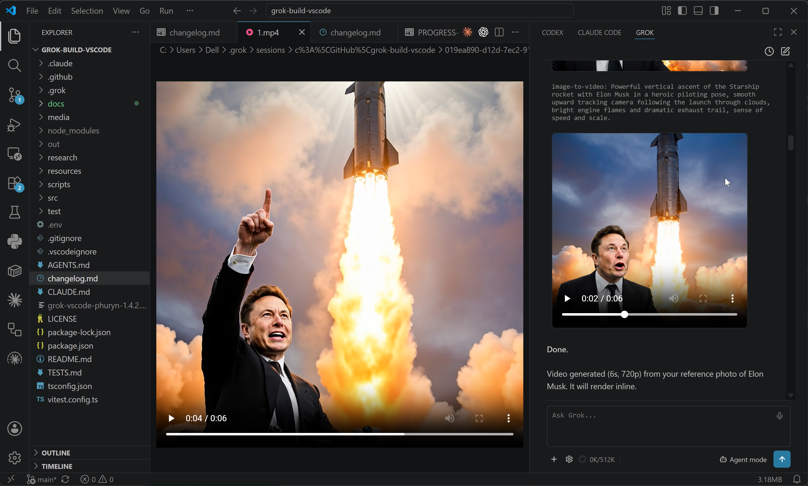
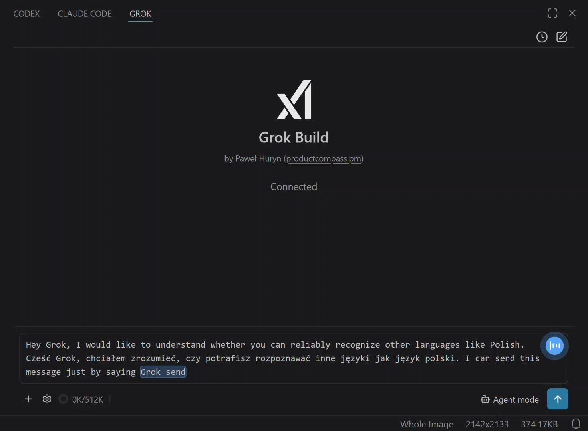
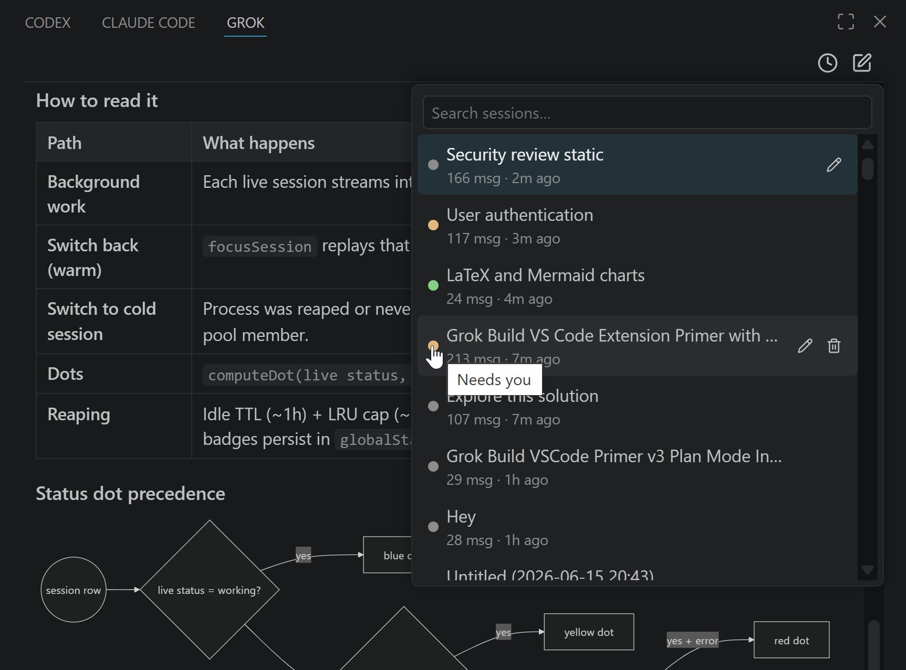
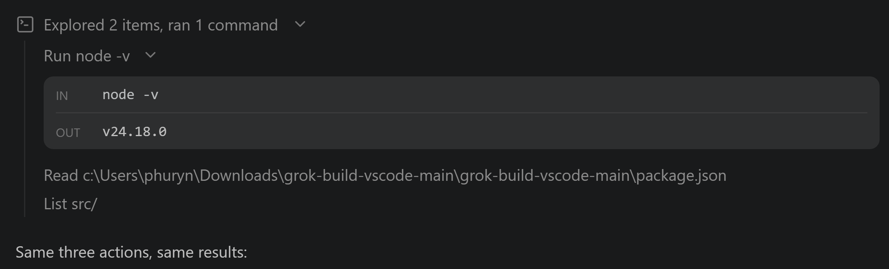

# Grok Build for VS Code (Community)

[](LICENSE) [](https://code.visualstudio.com) [](#) [](https://www.productcompass.pm)

> A VS Code UI for **xAI's Grok Build CLI** — not affiliated with or endorsed by xAI. *Grok*, *Grok Build*, and *xAI* are trademarks of xAI; this project uses those names only to describe what it's compatible with.

Use Grok Build inside a VS Code panel, drop your open files in as `@`-context, keep **resumable chat history**, generate **images & video inline**, and dictate by **voice**. If you'd rather stay in your editor than a terminal, this brings Grok Build's agent into your sidebar.

You install the `grok` CLI once and sign in — with a **SuperGrok or X Premium+ subscription**, or an **xAI API key** — and the extension is the GUI on top.

**Install free from the [VS Code Marketplace](https://marketplace.visualstudio.com/items?itemName=PawelHuryn.grok-vscode-phuryn) or [Open VSX Registry](https://open-vsx.org/extension/PawelHuryn/grok-vscode-phuryn)**




---

## Why use this?

If you live in your editor, this puts Grok Build right next to your code — a graphical workflow on top of the CLI: VS Code's **native diff editor** on a proposed edit before you approve it, **permission cards** (*Allow always / once / Reject*), your **active editor and selection as first-class `@file` context**, **session history** you can resume/rename/delete, **inline images and video** from `/imagine`, **voice dictation**, and **side-by-side** placement next to your other tools. The CLI does the heavy lifting; this is the GUI for when you'd rather not be in a terminal.

A short tour of how the extension is wired (and the one place it's deliberately *not* thin — Plan Mode) lives in [docs/architecture.md](docs/architecture.md).

---

## Requirements

- **VS Code** 1.90+ (or a compatible editor — Cursor, Windsurf, VSCodium).
- **The Grok Build CLI** (`grok`) on macOS, Linux, or Windows. The CLI ships a native Windows build, so the extension runs natively on all three — no WSL required (WSL2 + Remote-WSL still works if you prefer it).
- **A login:** either a **SuperGrok or X Premium+** subscription (`grok /login`) or an xAI API key. Either subscription unlocks **Grok Build**; with an API key you also get the **grok-4.x** models and **grok-imagine**. (Grok's free tier does **not** include the CLI agent.)
- **For voice control only** (optional): [`ffmpeg`](https://ffmpeg.org) on `PATH`, and a *separate* xAI API key for Speech-to-Text (pay-as-you-go, ~$0.10/hr — your CLI login does **not** cover it). See **Voice control** under [Features & capabilities](#features--capabilities).

---

## Install

**1. Install the CLI and sign in.**

macOS / Linux / WSL:

```bash
curl -fsSL https://x.ai/cli/install.sh | bash
grok /login
```

Windows (PowerShell):

```powershell
irm https://x.ai/cli/install.ps1 | iex
grok /login
```

`grok /login` opens a browser and completes OAuth in one step. Prefer an API key? Get one at [console.x.ai](https://console.x.ai) and set `XAI_API_KEY` in your shell or a workspace `.env` (the extension auto-loads it).

**2. Install the extension.**

From the Marketplace — search **Grok Build** by *PawelHuryn*, or:

```bash
code --install-extension PawelHuryn.grok-vscode-phuryn
```

Or build from source:

```bash
git clone https://github.com/phuryn/grok-build-vscode.git
cd grok-build-vscode
npm install
./scripts/install.sh        # Windows: pwsh scripts\install.ps1
```

Reload VS Code (**Ctrl+Shift+P → Developer: Reload Window**) and click the Grok icon in the activity bar.

> **Tip:** Right-click the Grok icon → **Move To → Secondary Side Bar** to park Grok on the right, next to other AI tools.
>
> 

**Uninstall:** `./scripts/uninstall.sh` (Windows: `pwsh scripts\uninstall.ps1`) or `code --uninstall-extension PawelHuryn.grok-vscode-phuryn`.

---

## Quick start

1. **Open** the Grok sidebar (activity bar icon, or `Ctrl/Cmd+;`).
2. **Type a prompt** and press **Enter**. Grok streams its answer, showing a *Thinking…* line while it reasons. Want the full reasoning inline? Turn on **Show thinking traces** in the gear menu → *Config & debug*.
3. **Approve actions.** When Grok wants to write a file or run a command it may raise a permission card — preview an edit in the native **diff editor**, then *Allow once / always / Reject*.
4. **Pick your mode** (Agent / Plan / Auto accept), **model**, and **reasoning effort** from the bottom toolbar and gear menu.
5. **Resume anytime** — the clock icon lists past sessions for this project.

---

## Features & capabilities

_Click any feature to expand._

<details>
<summary><strong>Permission cards with diff preview</strong> — see every edit in VS Code's native diff before you approve</summary>

When Grok proposes an edit, hit **open diff →** to review it in VS Code's native diff editor, then *Allow once / always* or *Reject*. The file is written only **after** you approve — no surprise changes to your files.


</details>

<details>
<summary><strong>Modes — Agent, Plan & Auto accept</strong></summary>

| Mode | Behaviour |
|---|---|
| **Agent** (default) | Grok acts directly and **may** ask permission for a write or shell action it judges sensitive — a card appears in chat. |
| **Plan** | Grok drafts a plan first and **cannot** write to the workspace or run anything outside a read-only allowlist until you approve. Approve / Reject / Cancel from the card, each with an optional comment. Plan Mode is enforced by the extension — see [How it works](#how-it-works). |
| **Auto accept** (YOLO) | The extension auto-approves every permission request. The CLI session is untouched — no restart, just a flag flip. |

</details>

<details>
<summary><strong>Image & video generation</strong> — <code>/imagine</code> renders right in the chat</summary>

Type `/imagine <prompt>` (or `/imagine-video <prompt>`) and the result renders **inline** — images as a compact thumbnail (capped at 320px; click to open the source file), videos with native playback controls. Hover either for **Copy path** / **Open in VS Code** icons. Both are **subscription-only** Grok features, both survive a session resume, and even a multi-MB video plays. Editing a reference photo with `/imagine` works too. Wire-format details, for the curious: [research/image-generation.md](research/image-generation.md).

</details>

<details>
<summary><strong>Voice control</strong> — hands-free dictation with live transcription</summary>

The **microphone button** in the composer dictates speech, transcribed by [xAI's Speech-to-Text API](https://docs.x.ai/developers/model-capabilities/audio/voice). Click it, wait for the blue listening waves, and speak — words appear live as you talk. Say **"grok send"** to submit hands-free and keep listening for the next message (dictate while Grok responds; those messages queue and flush when it finishes). Click the mic to stop and keep any in-progress text.

The two-word send phrase is deliberate (it won't fire on a message that merely ends in "send") and is configurable via `grok.voiceSendPhrase`. Streaming is the default; set `grok.voiceStreaming: false` for one-shot batch mode.

> **Cost:** Speech-to-Text is a *separate*, pay-as-you-go xAI product — **$0.10/hr** batch, **$0.20/hr** streaming, billed by audio duration. In practice ~500 words ≈ ½–1¢; a heavy 10,000-word day ≈ 10¢. It needs its own [console.x.ai](https://console.x.ai) key (`grok.voiceApiKey` / `GROK_VOICE_API_KEY` / `XAI_API_KEY`) — a SuperGrok subscription grants no API credit. Why it bypasses the CLI, and how the cost was measured end-to-end: [research/voice-input.md](research/voice-input.md).



</details>

<details>
<summary><strong>File chips</strong> — your editor and selection as <code>@file</code> context</summary>

The active editor is added as an **implicit** chip automatically (toggle with `grok.includeActiveFileByDefault`). Drag from the Explorer, right-click → **Grok: Send File**, press **Alt+G**, or use the **+** toolbar button to add **explicit** chips. Chips are sent as `@/path/to/file` references — the CLI resolves them, so content stays current and doesn't bloat chat history. Hold **Shift** while dragging to embed the file's contents inline as a fenced code block instead.

</details>

<details>
<summary><strong>Agent Dashboard</strong> — run several sessions at once, switch instantly, see which need you</summary>

Keep more than one session **alive at the same time**. Start a new session with **+** while another is mid-turn, and switch between them from the history dropdown — the one you leave keeps running in the background (mid-turn, mid-approval, anything), and switching back replays its exact state with **no reload**. Picking a session that isn't live anymore loads it from history as before.

Each row in the dropdown shows a **status dot** so you can see what every session is doing without opening it. It's **gray** at rest and only lights up when there's something to know:

| Dot | Meaning |
|---|---|
| 🔵 Blue | Working — a turn is in flight |
| 🟡 Yellow | Needs you — a permission, question, or plan is waiting |
| 🟢 Green | Finished, with output you **haven't opened yet** |
| 🔴 Red | Finished with an error you haven't opened |
| ⚪ Gray | At rest — idle, already read, or not loaded |

The green/red dot is an **unread** badge: it appears when a session finishes while you're looking at *another* one, and clears the moment you open it. It's persisted, so it survives idle cleanup **and** a VS Code restart — fire off a few agents, walk away, and the green dots are exactly the sessions with results waiting.

To keep a pile of background sessions from each pinning a live process, a session left untouched for an hour (or beyond ~8 live) is quietly shut down — never one that's working or waiting on you — and reloads from history on click, losing nothing.



</details>

<details>
<summary><strong>Session history</strong> — resume, rename, delete, or clear past sessions</summary>

The clock icon lists this project's sessions, newest first. Click a row to resume — Grok replays the conversation, with inline images, plans, and reasoning intact — or hover to rename or delete it. The list loads the **most recent 100** and pulls in older ones as you **scroll**; the **search box** filters by name across your whole history, so it stays fast even with thousands of sessions. **Clear all history** (bottom of the dropdown) removes every session for this project except the current one, after a confirm. Renames are stored by the extension and never touch Grok's own files.


</details>

<details>
<summary><strong>Tool calls</strong> — every read, edit & command, inline</summary>

Every action Grok takes appears in chat as a **category-iconed** row — a single line, or a batch summarized by what it did ("Explored 5 items", "Edited 2 files") that expands to the full list on click. A tool that **fails** turns red with the reason inline.



</details>

<details>
<summary><strong>Math &amp; LaTeX rendering</strong> — equations render as math, not raw TeX</summary>

When Grok answers with LaTeX — inline `\(…\)`, display `\[…\]`, and environments like matrices, `cases`, integrals, sums, and Greek — the chat renders it as real typeset math via [MathJax](https://www.mathjax.org), bundled so it works **offline**. **Hover a display equation** to copy its LaTeX source or export it as a PNG or transparent SVG. Bare `$…$` is intentionally **not** a delimiter — it would mangle prose like "it costs $5 and then $10".


</details>

<details>
<summary><strong>Mermaid diagrams</strong> — flowcharts and sequence diagrams render as diagrams</summary>

When Grok answers with a ` ```mermaid ` block — flowcharts, sequence and state diagrams, git graphs, class and ER diagrams — the chat renders it as a real diagram via [Mermaid](https://mermaid.js.org), bundled so it works **offline**, themed to your light/dark mode. **Hover a diagram** to copy its source or export it as a PNG or transparent SVG. While it's still streaming or if it's malformed, the readable source is shown instead — you never lose the content.


</details>

<details>
<summary><strong>Model picker</strong> — switch models live, no restart</summary>

Click the model name in the gear popover. The model list comes from your CLI; switching is live with no restart in most cases. (A few models belong to a different agent and need a quick session restart — the extension detects that and handles it for you, carrying your context forward.)

</details>

<details>
<summary><strong>Reasoning effort</strong> — trade tokens for depth</summary>

Gear icon → effort dots pick a level (`none` → `xhigh`), forwarded to the CLI as `--reasoning-effort`. Changing it restarts the session, with an optional *Summarize & Restart* to carry context forward. (Some subscription tiers may reject effort at the backend.)

</details>

<details>
<summary><strong>Cost control</strong> — token donut, <code>/compact</code> & effort</summary>

Stay on top of spend without leaving the sidebar: the bottom-toolbar **context donut** shows `usedK/maxK` tokens after each prompt; **`/compact`** (gear → Compact) compresses the conversation when it fills, or **+** starts fresh. **Reasoning effort** trades tokens for depth, and voice STT cost is called out above.

</details>

<details>
<summary><strong>MCP servers</strong> — whatever the CLI loads</summary>

MCP servers are configured in the CLI (`~/.grok/config.toml` global, `.grok/config.toml` project) — the extension picks up whatever the CLI loads:

```bash
grok mcp add playwright --command npx --args @playwright/mcp@latest
```

Or edit the config via gear → *Open global / project config*, then click **+** to reload.

</details>

---

## Configuration

<details>
<summary><strong>All <code>grok.*</code> settings</strong> (VS Code Settings → search "grok")</summary>

| Setting | Default | Notes |
|---|---|---|
| `grok.cliPath` | `""` | Path to the `grok` binary. Empty = auto-discover (`~/.grok/bin/grok` → PATH). |
| `grok.defaultModel` | `""` | Model ID for new sessions. Empty = CLI default. |
| `grok.defaultEffort` | `""` | Reasoning effort forwarded as `--reasoning-effort` (`none` / `minimal` / `low` / `medium` / `high` / `xhigh`). Empty = CLI default. Changing it restarts the session. |
| `grok.defaultMode` | `""` | Mode for new sessions, remembered automatically from your last Agent / Auto accept switch (Plan is never remembered). Empty = Agent. |
| `grok.includeActiveFileByDefault` | `true` | Auto-add the active editor as a context chip. |
| `grok.useCtrlEnterToSend` | `false` | When true, Enter inserts a newline and Ctrl/Cmd+Enter sends. |
| `grok.showThinking` | `false` | Show Grok's reasoning (thinking) traces in chat. Off shows a *Thinking…* stand-in. Also toggleable live from gear → Config & debug. |
| `grok.telemetry.enabled` | `true` | Send anonymous, privacy-first usage telemetry (see [Privacy](#privacy)). Also honors VS Code's global `telemetry.telemetryLevel`. |
| `grok.chatFontScale` | `100` | Zoom for the chat panel only, as a percent (`150`, `200`, …). Scales the whole chat UI without rescaling the rest of VS Code (unlike `Ctrl/Cmd+Shift+=`). Applies live; supports User (global) and Workspace (local) scope. |
| `grok.voiceApiKey` | `""` | xAI API key for voice Speech-to-Text — a separate [console.x.ai](https://console.x.ai) developer key, not the CLI login. Empty = fall back to `GROK_VOICE_API_KEY` / `XAI_API_KEY` in the workspace `.env`. |
| `grok.ffmpegPath` | `""` | Path to `ffmpeg` for microphone recording. Empty = use `ffmpeg` from `PATH`. |
| `grok.voiceInputDevice` | `""` | Microphone device override. Empty = system default (Windows auto-detects the first DirectShow audio device). |
| `grok.voiceSendPhrase` | `"grok send"` | Spoken phrase that auto-submits when it ends a transcription. Empty = disable hands-free sending. |
| `grok.voiceStreaming` | `true` | Stream transcription live as you speak. `false` = one-shot batch mode. Streaming costs $0.20/hr vs $0.10/hr batch. |

</details>

---

## Commands & keybindings

<details>
<summary><strong>VS Code commands & keys</strong> (Ctrl/Cmd+Shift+P → "Grok")</summary>

VS Code commands (not Grok slash commands):

| Command | What it does |
|---|---|
| `Grok: Open` | Open the Grok sidebar |
| `Grok: New Session` | Start a fresh session |
| `Grok: Pick Model` | Open the model picker |
| `Grok: Toggle Plan / Agent Mode` | Open the mode picker (Agent / Plan / Auto accept) |
| `Grok: Send File` | Add the selected file to context |
| `Grok: Send Selection` | Send the current text selection to Grok |
| `Grok: Insert @-Mention` | Insert an `@`-mention for the active file into the composer |
| `Grok: Show Logs` | Open the Grok output channel (ACP messages, errors) |
| `Grok: Log Out` | Sign out of the Grok CLI (`grok logout`) and return to the sign-in screen |

| Key | Action |
|---|---|
| `Ctrl+;` / `Cmd+;` | Open Grok sidebar |
| `Alt+G` | Insert `@`-mention for the active file (when the editor is focused) |

Grok's own **slash commands** (`/imagine`, `/compact`, …) autocomplete in the composer when you type `/`, sourced live from your installed CLI version. Reference snapshot: [docs/SLASH-COMMANDS.md](docs/SLASH-COMMANDS.md).

</details>

---

## How it works

The extension is intentionally **thin**: it speaks JSON-RPC over `grok agent stdio` and renders the results. Grok owns sessions, memory, MCP, models, and tool execution; the extension mediates file reads/writes, terminal requests, diff previews, the webview UI — and **Plan Mode**.

Plan Mode is the one place the extension is *not* thin. The CLI's `exit_plan_mode` is unreliable (it reports "approved" to any reply), so the extension enforces planning itself: a **gate** blocks workspace writes and non-read-only commands until you approve, and a hidden **primer** message teaches Grok to read your real verdict (`[Plan approved]` / `[Plan rejected]` / `[Plan cancelled]`) from your next message. The primer is fired **eagerly and silently** the instant a session goes live (not in front of your first prompt), and is kept lean so it doesn't add a startup pause — your first real message simply waits, in code, for the silent primer turn to finish (Grok runs one turn at a time) and is released the moment it does.

Full diagram, message flow, module map, and design notes: **[docs/architecture.md](docs/architecture.md)**.

---

## Development

<details>
<summary><strong>Build, test & repo conventions</strong></summary>

```bash
npm install
npm test         # grok-free unit/DOM/integration suite — exactly what CI runs
npm run package  # → grok-vscode-phuryn-<version>.vsix
```

`npm test` is grok-free, so **local ≡ CI** — it never spawns the real binary. A separate, on-demand `npm run test:live` drives the actual `grok` end-to-end (handshake, restore, plan-mode, image/video gen) and is run **before a release**, not on every commit. Full test taxonomy and what's deferred to a future `@vscode/test-electron` suite: **[TESTS.md](TESTS.md)**. Architecture and module map: **[docs/architecture.md](docs/architecture.md)**.

**Repo conventions:** direct-to-`main`, no feature branches; commits explain the *why*; no speculative abstractions; the grok-free suite is the floor — every change keeps it green.

</details>

---

## Known limits

- **Diff preview semantics.** The diff editor compares the proposed old vs. new text against each other, not against the file on disk at preview time. The write happens via `fs/write_text_file` after approval. This is an ACP constraint — `tool_call_update` carries the diff before the file is touched.
- **No worktree UI.** `Grok: New Worktree Session` is planned but not yet implemented.
- **View placement.** The view defaults to the left activity bar; drag it to the secondary side bar manually if you want it on the right.

---

## Privacy

**Privacy by design** — no message content, no code, no file paths, and no account/email/login identity ever leave your machine. The only thing sent is an anonymous, opt-out usage count. Turn it off anytime with `grok.telemetry.enabled: false` or VS Code's global `telemetry.telemetryLevel`.

More: [docs/privacy.md](docs/privacy.md).

---

## License & attribution

Licensed under the **MIT License** — see [LICENSE](LICENSE). MIT is permissive (use, modify, sell, even in closed-source products) but **not** obligation-free: the copyright notice and license text must travel with **all copies, including compiled builds**. If you're reusing this project, see [docs/attribution.md](docs/attribution.md) for what that means and how to credit it properly.
