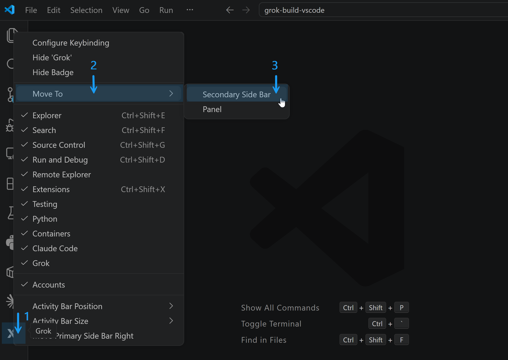

# Grok Build for VS Code

[](LICENSE) [](https://code.visualstudio.com) [](https://x.ai) [](https://www.productcompass.pm)

A user-friendly Visual Studio Code extension. An embedded chat UI — **not a terminal launcher**. Streams responses with thinking traces, tool calls, file chips, and permission cards with diff preview. Resume past sessions, click file references in chat to open them, and drag files into the composer (hold **Shift** to embed contents inline). Not affiliated with xAI.

Wraps the Grok Build CLI over the [Agent Client Protocol (ACP)](https://agentclientprotocol.com) — all session state, MCP servers, subagents, memory, and tool execution stay inside that CLI process. Kill the extension and the `grok` child dies with it; kill `grok` and the extension shows an error and lets you start a fresh session.

Works with SuperGrok Heavy subscription or xAI API key (standard Grok). **Not affiliated with xAI.**


---

## Why an extension, not the CLI?

- **Toolbar dropdowns for model, effort, and mode** — pick from menus instead of slash commands or env vars
- **IDE context as first-class chips** — active editor, selection, and drag-from-Explorer files send as `@/path/to/file` references so the CLI re-reads the live file, not a paste-frozen copy. Hold **Shift** while dragging to embed the file content inline as a fenced code block instead
- **Session management UI** — clock icon in the top bar lists past sessions (saved by the CLI in `~/.grok/sessions/`); resume, rename, or delete any of them
- **Click file references in chat to jump to them** — backticked paths like `` `src/sidebar.ts:42` `` open the file in VS Code at that line
- **Copy any message + hover for the timestamp** — hover any chat bubble to reveal a copy button and when it was sent
- **Collapsed thinking traces and grouped tool calls** — a single "Thinking..." line that resolves to "Thought for *N*s" (reasoning content is hidden by design); multi-call rows fold into "Read, Edit +2" and expand on click
- **VS Code diff editor for proposed edits** — click "open diff →" on a permission card to see the exact change before approving
- **Permission cards** with **Allow always / Allow once / Reject** instead of `[y/N]` terminal prompts
- **Upload from computer** — `+` button in the bottom toolbar opens a file picker; picked files are added as `@path` chips (no contents injected)
- **Slash autocomplete sourced live from the CLI** via `available_commands_update` — reflects exactly what your installed version supports, including installed skills and plugins
- **YOLO mode toggled in-process** — no CLI restart, the session is untouched
- **Side-by-side with other AI tools** — drag the icon to the secondary side bar to sit next to Copilot Chat / Claude Code

Trade-off: this is a UI shell, not a replacement. Install the `grok` CLI first; the extension is useless without it.

---

## Compared with other VS Code AI extensions

UX-only comparison with Claude Code and Codex — not a verdict on the underlying models. Based on [this infographic from The Product Compass](https://www.productcompass.pm); the **Grok Build** column reflects current state (drag & drop and multi-session shipped since the infographic was published).

| Feature | Claude Code | **Grok Build** | Codex |
|---|---|---|---|
| Collapsible messages | ✓ | ✓ | — |
| Copy message | — | ✓ | ✓ |
| Timestamps | — | ✓ | ✓ |
| Thinking traces | ✓ | ✓ | ✓ |
| Tool calls | ✓ (verbose) | ✓ (collapsed) | ✓ (collapsed) |
| Selected file path in context | ✓ | ✓ | ✓ |
| Drag & drop | ✓ | ✓ | ✓ |
| Inline diffs | ✓ | ⏸ ACP limitation (uses separate diff editor) | ✓ (collapsed) |
| Plan mode | ✓ | ⏳ in progress (hook-based workaround being explored) | ✓ |
| Multiple sessions | ✓ | ✓ | ✓ |
| Voice control | ✓ | ⏳ in progress | — |

---

## Quick start

> **Platforms:** macOS and Linux. The `grok` CLI has no Windows build — on Windows, use WSL2 + VS Code Remote-WSL and install everything on the WSL side.

**1. Install and sign in to the CLI:**

```bash
curl -fsSL https://x.ai/cli/install.sh | bash
grok /login
```

`grok /login` opens a browser and completes OAuth in one step. Alternatively, get an API key at [console.x.ai](https://console.x.ai) and set `XAI_API_KEY` in your shell or a workspace `.env` (the extension auto-loads it). With a subscription you get **Grok Build**; with an API key you also get **grok-4.20** (3 variants), **grok-4.3**, and **grok-imagine** (3 options).

**2. Install the extension.**

From the VS Code Marketplace: search for **Grok Build** by *PawelHuryn*, or install from the command line:

```bash
code --install-extension PawelHuryn.grok-vscode-phuryn
```

Or build from source:

```bash
git clone https://github.com/phuryn/grok-build-vscode.git
cd grok-build-vscode
npm install
./scripts/install.sh
```

Reload VS Code (**Ctrl+Shift+P → Developer: Reload Window**) and click the Grok icon in the activity bar.

> **Tip:** Right-click the Grok icon → **Move To → Secondary Side Bar** to park Grok on the right alongside other AI tools.
>
> 

**Uninstall:** `./scripts/uninstall.sh` or `code --uninstall-extension PawelHuryn.grok-vscode-phuryn`.

---

## Key concepts

### Thin client over ACP

The extension speaks JSON-RPC over `grok agent stdio`'s stdin/stdout. It implements every mandatory server→client handler (`fs/read_text_file`, `fs/write_text_file`, `terminal/{create,output,wait_for_exit,kill,release}`) — missing any of them crashes the agent mid-session.

### Where state lives

| Lives in the CLI | Lives in the extension |
|---|---|
| Conversation history, memory, `~/.grok/` | Chips list (active editor + drag-added files) |
| MCP servers, subagents, plugins | YOLO flag (auto-approval) |
| Plan-mode bookkeeping | Webview UI state, popovers, slash filter |
| Tool execution, model state | Pending diff content per `toolCallId` |

Restarting the session (the **+** button) kills the CLI child and spawns a fresh one. Memory persisted by the CLI in `~/.grok/` survives.

### Modes

| Mode | Behaviour |
|---|---|
| **Agent** (default) | CLI asks for permission before each write or shell action — a card appears in chat |
| **YOLO** | Extension auto-responds "allow always" to every `session/request_permission`. The CLI process and its session are untouched, no restart |
| **Plan** | ⚠️ Currently disabled — the CLI treats every client response to `x.ai/exit_plan_mode` as approval, so Reject would silently approve. A hook-based workaround (intercepting plan submission client-side) is being explored. See [Known limits](#known-limits) |

### File chips

The active editor file is added as an **implicit** chip automatically (toggle via `grok.includeActiveFileByDefault`). Drag from the Explorer, right-click → **Grok: Send File**, press **Alt+G**, or click the **+** button in the bottom toolbar → *Upload from computer* to add **explicit** chips. Chips are sent to the agent as `@/path/to/file` references — the CLI resolves them, so content stays current and doesn't bloat chat history. Hold **Shift** while dragging to embed the file content inline as a fenced code block instead.

### Session history

Click the clock icon in the top bar to see all sessions saved by the CLI for the current project (grok writes them to `~/.grok/sessions/<urlencoded-cwd>/`). Click a row to resume — the extension calls `session/load` and grok replays the conversation. Hover a row to rename (pencil) or delete (trash). Names default to the first message sent in that session; rename overrides live in VS Code's `globalState` and never touch grok's files.

### Permission cards with diff preview

For `kind:"edit"` tool calls, the card shows a `path — N → M lines` summary and an "open diff →" button. Clicking it opens VS Code's native diff editor against the proposed new content. Note: the actual write only happens *after* you approve, via `fs/write_text_file`. See [Known limits](#known-limits) for the v1.0 caveat on what the diff is actually diffed against.

---

## Architecture

```
VS Code webview ──postMessage──► extension host ──JSON-RPC over stdin/stdout──► grok agent stdio
                                                  ◄── session/update (message chunks, thought chunks, tool calls, mode changes)
                                                  ◄── fs/read_text_file, fs/write_text_file
                                                  ◄── terminal/create, terminal/output, terminal/wait_for_exit, terminal/kill, terminal/release
                                                  ◄── session/request_permission
                                                  ◄── x.ai/exit_plan_mode
```

### How a session starts

When the panel opens (or you click **+** for a new session):

1. Locate the `grok` binary: `grok.cliPath` setting → `~/.grok/bin/grok` → `PATH`.
2. Spawn `grok agent stdio` as a background child — visible in `ps` / Activity Monitor, never opens a terminal window.
3. Send `initialize` → `session/new` → `session/set_model` over stdio.
4. If `grok.defaultEffort` is set, pass `--reasoning-effort <level>` at spawn time.
5. Stream `session/update` notifications (messages, thoughts, tool calls, permission requests) back to the chat.

### Module map

| File | Role |
|---|---|
| [src/extension.ts](src/extension.ts) | Entry point — registers commands, keybindings, output channel |
| [src/sidebar.ts](src/sidebar.ts) | Webview provider, message routing, fs handlers, diff preview |
| [src/acp.ts](src/acp.ts) | ACP client — spawns CLI, manages session lifecycle, emits events |
| [src/acp-dispatch.ts](src/acp-dispatch.ts) | Pure protocol helpers — line parsing, update routing, response builders |
| [src/cli-locator.ts](src/cli-locator.ts) | Locate `grok` binary; cross-platform |
| [src/terminal-manager.ts](src/terminal-manager.ts) | Headless shells for the agent's `terminal/*` calls |
| [src/chips.ts](src/chips.ts) | File-chip CRUD (pure) |
| [src/prompt-builder.ts](src/prompt-builder.ts) | Chip → prompt-string with `@path` refs and fenced blocks |
| [src/slash-filter.ts](src/slash-filter.ts) | Slash-command autocomplete filter |
| [src/sessions.ts](src/sessions.ts) | Disk-driven session listing/delete + customName overrides (pure) |
| [media/chat.{js,css}](media/) | Webview UI |
| [media/webview-helpers.js](media/webview-helpers.js) | Pure webview helpers (file-ref detection, relative-time format); shared between webview and tests |

### Design choices worth knowing

- **Pure modules split for testability.** `acp-dispatch`, `chips`, `prompt-builder`, `slash-filter`, `cli-locator`, `sessions`, `webview-helpers` have no `vscode` import, no spawn, no network — they run under Vitest in a Node process. 94 tests in under two seconds.
- **YOLO is client-side only.** It's a single `autoApprove` flag in [src/sidebar.ts](src/sidebar.ts) — toggling Agent ↔ YOLO doesn't restart the CLI or even send a message. The CLI keeps asking; the extension just answers "allow always" automatically.
- **Cross-platform without per-OS branches.** [src/terminal-manager.ts](src/terminal-manager.ts) uses `spawn(cmd, { shell: true })` so Node picks `cmd.exe` or `/bin/sh`. [src/cli-locator.ts](src/cli-locator.ts) prefers `HOME`/`USERPROFILE` env over `os.homedir()` so tests can override paths.
- **Streaming is rAF-coalesced.** `agent_message_chunk` and `agent_thought_chunk` buffer into a raw string and re-render at most once per animation frame — keeps long responses smooth even under fast chunk rates.
- **`available_commands_update` drives slash autocomplete.** No hardcoded command list; the CLI tells the extension what's available, so plugin/skill installs surface immediately.

---

## Usage

### Sending a prompt

Type in the composer and press **Enter** (or **Ctrl/Cmd+Enter** if `grok.useCtrlEnterToSend` is on). The agent streams its response; while it reasons, a single "Thinking..." line shows, which resolves to "Thought for *N*s" on completion. (Reasoning traces themselves are hidden — only the timing line surfaces.)

### Slash commands

Type `/` to open autocomplete. Commands are sourced live from the CLI — the list reflects your installed `grok` version. See [docs/SLASH-COMMANDS.md](docs/SLASH-COMMANDS.md) for a reference snapshot.

### Tool calls

Each action appears in chat:
- **Single call** — flat row: "Read sidebar.ts lines 1–120", "Edit package.json", "Run npm test"
- **Multiple calls** — collapsed group ("Read, Edit +2") that expands on click

### Reasoning effort

Click the **gear** icon → effort dots to choose Low → Max. Changing effort restarts the session with `--reasoning-effort <level>`. If chat history exists, a dialog offers **Summarize & Restart** (asks Grok for a summary, starts a fresh session, sends the summary as context) or **Just Restart** (discards).

### Model picker

Click the model name in the gear popover. The list comes from `session/new`'s response — switching is live via `session/set_model`, no restart.

### Context donut

The bottom-toolbar donut shows `usedK/maxK` tokens, updated after each prompt. When it fills, `/compact` compresses the conversation or click **+** for a fresh session.

### Gear popover

| Section | What |
|---|---|
| Model and Effort | Model picker + reasoning effort dots |
| Session | Compact conversation (sends `/compact`) |
| Config | Open global `~/.grok/config.toml`, project `.grok/config.toml`, `grok mcp list` |
| Debug | Show extension logs (every ACP message in/out) |

### MCP servers

MCP servers are configured in the CLI (`~/.grok/config.toml` global, `.grok/config.toml` project) — the extension picks up whatever the CLI loads. Add a server with the CLI:

```bash
grok mcp add playwright --command npx --args @playwright/mcp@latest
```

Or edit the config files directly via gear → *Open global config* / *Open project config*. Click the new-session button in the sidebar to reload.


---

## Configuration

| Setting | Default | Notes |
|---|---|---|
| `grok.cliPath` | `""` | Path to the `grok` binary. Empty = auto-discover (`~/.grok/bin/grok` → PATH). |
| `grok.defaultModel` | `""` | Model ID for new sessions. Empty = CLI default. |
| `grok.defaultEffort` | `""` | Reasoning effort (`low` / `medium` / `high` / `xhigh` / `max`). Empty = CLI default. Changing this restarts the session. |
| `grok.includeActiveFileByDefault` | `true` | Auto-add the active editor as a context chip. |
| `grok.useCtrlEnterToSend` | `false` | When true, Enter inserts a newline and Ctrl/Cmd+Enter sends. |

---

## Commands & keybindings

VS Code commands (not Grok slash commands). Open with **Ctrl+Shift+P** / **Cmd+Shift+P** and type "Grok".

| Command | What it does |
|---|---|
| `Grok: Open` | Open the Grok sidebar |
| `Grok: New Session` | Start a fresh session |
| `Grok: Pick Model` | Open the model picker |
| `Grok: Toggle Plan / Agent Mode` | Open the mode picker (Agent / Plan / YOLO). Plan is currently disabled — see Known limits. |
| `Grok: Send File` | Add the selected file to context |
| `Grok: Send Selection` | Send the current text selection to Grok |
| `Grok: Insert @-Mention` | Insert an `@`-mention for the active file into the composer |
| `Grok: Show Logs` | Open the Grok output channel (ACP messages, errors) |

**Keybindings**

| Key | Action |
|---|---|
| `Ctrl+;` / `Cmd+;` | Open Grok sidebar |
| `Alt+G` | Insert `@`-mention for the active file (when editor focused) |

---

## Development

```bash
npm install
npm test         # 94 tests, <2s, vitest — no VS Code, no spawn (except terminal-manager)
npm run package  # → grok-vscode-phuryn-<version>.vsix
```

Pure tests are the floor — every change should keep 94 green. The split was made *specifically* so protocol bugs can be caught without spinning up VS Code:

- `test/acp-dispatch.test.ts` — wire format, `parseAcpLine`, `routeSessionUpdate`, response builders
- `test/chips.test.ts` — file-chip CRUD
- `test/prompt-builder.test.ts` — chip → prompt assembly
- `test/slash-filter.test.ts` — autocomplete filter
- `test/cli-locator.test.ts` — binary discovery
- `test/sessions.test.ts` — disk-driven session listing, naming fallback, delete
- `test/webview-helpers.test.ts` — file-ref detection, relative-time formatting
- `test/terminal-manager.test.ts` — real `/bin/sh` spawn smoke

See [TESTS.md](TESTS.md) for the full breakdown of what's covered vs deferred to a future `@vscode/test-electron` integration suite.

**Smoke testing against a real CLI:** install the VSIX into VS Code, open the panel, and run a few prompts that exercise reads, writes, terminal, and permission flow. The pure tests cover protocol regressions; smoke testing covers integration with the actual `grok` binary.

**Repo conventions:**
- Direct-to-`main`, no feature branches
- Commits explain the *why*, not the *what*
- No speculative abstractions; no comments restating well-named code

**Publishing:** bump `package.json` version, `npm test`, `npm run publish` (requires `vsce login PawelHuryn` once with an Azure DevOps PAT).

---

## Known limits

- **Plan mode disabled.** The `x.ai/exit_plan_mode` ACP response path in the current CLI version treats any client response — result or error — as approval. Enabling the UI without working Reject/Abandon would silently approve every plan. Two paths to re-enable: (a) wait for the CLI to wire up the rejection code path, or (b) a hook-based workaround where the extension intercepts plan output before the CLI sees a client response. The hook approach is being explored.
- **Diff preview semantics.** The diff editor compares the proposed old and new text against each other, not against the file on disk at the moment of preview. The actual write happens via `fs/write_text_file` after approval. This is an ACP design constraint — `tool_call_update` carries the diff before the file is touched.
- **No subagent inspector.** Subagent messages render inline as tool cards rather than in a dedicated panel.
- **No worktree UI.** `Grok: New Worktree Session` is planned but not yet implemented.
- **No voice control.** Voice input is on the roadmap but not yet implemented.

---

## License

MIT
