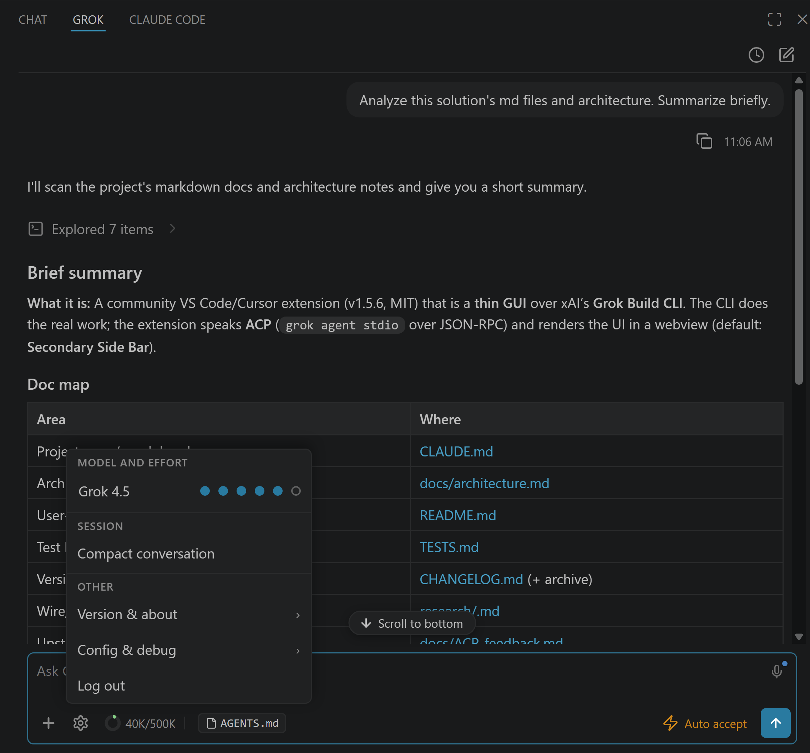
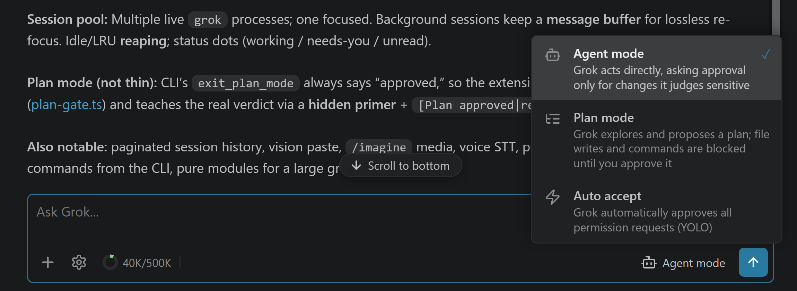
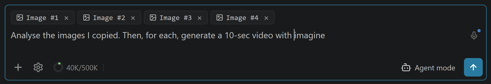
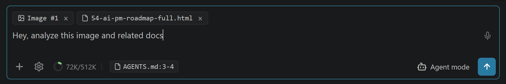
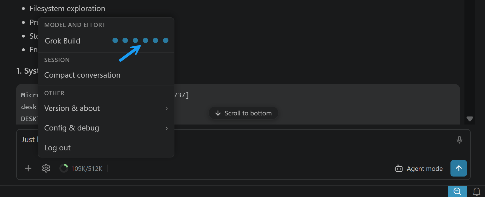
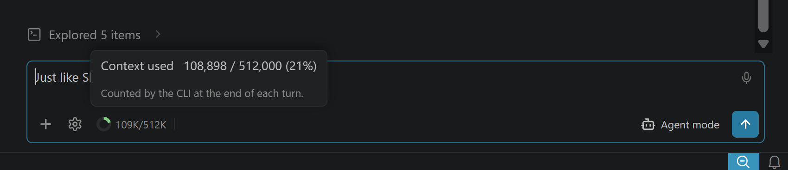

# Grok Build for VS Code（社区版）

[](LICENSE) [](https://code.visualstudio.com) [](#) [](https://github.com/ziyuhaokun)

> **Grok Build CLI 的图形界面（含 Grok 4.5）** — 与 xAI 无隶属关系，亦未经其背书。*Grok*、*Grok Build* 与 *xAI* 为 xAI 的商标；本项目仅用其名称说明兼容对象。由 **ziyuhaokun** 维护。

在编辑器里直接使用 **Grok Build CLI**（含 **Grok 4.5**）：用 `@` 附上打开的文件、同时跑 **多个会话**、可 **恢复的聊天历史**、内联 **生成图片与视频**，以及 **语音** 输入。若你更想待在 VS Code 而不是终端里，本扩展把 Grok Build 代理放进侧栏。

无需手动折腾：扩展会 **引导你安装 `grok` CLI 并登录** — 可用 **SuperGrok 或 X Premium+ 订阅**，或 **xAI API 密钥** — 全在侧栏里一步一点完成。

**本地安装：** 从源码构建后侧载 `.vsix`（见下方开发说明与 [docs/INSTALL.md](docs/INSTALL.md)）。扩展 ID：`ziyuhaokun.grok-vscode-ziyuhaokun`。




---

## 为什么用这个？

如果你主要待在编辑器里，本扩展把 Grok Build 放在代码旁边 — 在 CLI 之上提供图形工作流：对拟议修改打开 VS Code **原生 diff 编辑器** 再批准、**权限卡片**（*始终允许 / 仅此一次 / 拒绝*）、**活动编辑器与选区作为一等 `@file` 上下文**、可恢复/重命名/删除的 **会话历史**、来自 `/imagine` 的 **内联图片与视频**、**语音听写**，以及与其它工具 **并排** 放置。重活仍由 CLI 完成；当你不想待在终端时，这就是 GUI。

扩展如何接线的简短导览（以及故意做得「不薄」的一处 — 计划模式）见 [docs/architecture.md](docs/architecture.md)。

---

## 系统要求

- **VS Code** 1.106+（或同内核兼容编辑器 — Cursor 3.x 可用；Antigravity 仍基于 1.104，请使用最后一个兼容的扩展版本）。
- **Grok Build CLI**（`grok`），支持 macOS、Linux 或 Windows。CLI 提供原生 Windows 构建，扩展在三平台原生运行 — **不需要 WSL**（若偏好，WSL2 + Remote-WSL 仍可用）。
- **登录方式：** **SuperGrok 或 X Premium+** 订阅（`grok login`），或 xAI API 密钥。任一订阅可解锁 **Grok Build**；使用 API 密钥还可使用 **grok-4.x** 模型与 **grok-imagine**。（Grok **免费层不包含** CLI 代理。）

---

## 安装

**1. 安装扩展。** 从源码构建并侧载（推荐）：

```bash
npm install
npm run package   # → grok-vscode-ziyuhaokun-<version>.vsix
# Windows:
pwsh scripts\install.ps1
# macOS / Linux:
./scripts/install.sh
```

或在 VS Code / Cursor 中：扩展视图 → `…` → **从 VSIX 安装…**，选择生成的 `.vsix`。

**2. 打开 Grok 并登录。** 按 `Ctrl/Cmd+;`。侧栏会 **引导你安装 `grok` CLI 并登录** — 每步一点，支持 SuperGrok / X Premium+ 订阅或 xAI API 密钥。安装到此即完成。

Grok 默认打开在 **辅助侧栏**（右侧，与其它 AI 工具相邻）。想换位置？齿轮 → **配置与调试** → **移动视图**，可一键移到面板或主侧栏。

> 更想用终端、从源码构建，或一次装进多个 IDE？见 **[docs/INSTALL.md](docs/INSTALL.md)**。

---

## 快速开始

1. **打开** Grok 视图（`Ctrl/Cmd+;`，或命令面板中的 **Grok: 打开**）— 默认在辅助侧栏。
2. **输入提示** 并按 **Enter**。Grok 会流式回答，推理时显示 *思考中…*。想看完整推理？在齿轮菜单 → *配置与调试* 中打开 **显示思考轨迹**。
3. **批准操作。** 当 Grok 要写文件或跑命令时可能弹出权限卡片 — 在原生 **diff 编辑器** 中预览修改，然后 *仅此一次 / 始终允许 / 拒绝*。
4. 在底部工具栏与齿轮菜单中选择 **模式**（代理 / 计划 / 自动接受）、**模型** 与 **推理力度**。
5. **随时恢复** — 时钟图标列出本项目的历史会话。

---

## 功能与能力

_点击任一项展开。_

<details>
<summary><strong>带 diff 预览的权限卡片</strong> — 在 VS Code 原生 diff 中审阅每处修改后再批准</summary>

当 Grok 提出编辑时，点 **打开 diff →** 在 VS Code 原生 diff 编辑器中审阅，再 *仅此一次 / 始终允许* 或 *拒绝*。文件 **仅在你批准后** 才会写入 — 不会悄悄改你的文件。


</details>

<details>
<summary><strong>模式 — 代理、计划与自动接受</strong></summary>

从底部工具栏切换；选择器会说明各模式。标签之外还需知道：

- **计划** 由 *扩展* 强制执行，而非 CLI — 工作区写入与非只读命令在真正批准前会被拦截；你在计划卡片上批准 / 拒绝 / 取消，均可附带可选备注。见 [工作原理](#工作原理)。
- **自动接受** 只是切换当前会话上的标志 — 无需重启，CLI 会话保持不变。



</details>

<details>
<summary><strong>图片与视频生成</strong> — <code>/imagine</code> 直接在聊天中渲染</summary>

输入 `/imagine <提示>`（或 `/imagine-video <提示>`），结果 **内联** 显示 — 图片为紧凑缩略图（最大 320px；点击打开源文件），视频带原生播放控件。悬停可 **复制路径** / **在 VS Code 中打开**。二者均为 **订阅专属** Grok 功能，会话恢复后仍可用，即使是数 MB 的视频也能播放。用 `/imagine` 编辑参考图同样支持。线格式细节（好奇者）：[research/image-generation.md](research/image-generation.md)。

</details>

<details>
<summary><strong>粘贴或附加图片</strong> — Grok 看到的是像素，不只是路径</summary>

**Ctrl+V 截图**、拖放图片，或用 **+** 选择器附加（png/jpg/gif/webp，最大 20 MiB）— 会作为视觉输入内联发送，你可以对刚截的错误对话框问 *「这个 UI 哪里不对？」*，或一次给 Grok 多张参考图。从磁盘导入的会保留文件路径，便于 Grok 操作真实文件；芯片在重新打开会话时会恢复；无法读取的图片会阻止发送而非静默消失。SVG 故意只作为 *路径* 附件 — 你通常希望 Grok 编辑源文件，而不是「看」它。线细节：[research/vision-input.md](research/vision-input.md)。



</details>

<details>
<summary><strong>文件芯片</strong> — 编辑器与选区作为 <code>@file</code> 上下文</summary>

活动编辑器默认以 **隐式** 芯片附带（`grok.includeActiveFileByDefault`）；可从资源管理器拖入、右键 → **Grok: 发送文件**、**Alt+G** 或 **+** 按钮添加更多。芯片以 CLI 可解析的 `@/path` 引用发送 — 内容始终最新，历史体积小。**Shift+拖放** 则内联嵌入文件内容。



</details>

<details>
<summary><strong>代理仪表盘</strong> — 同时跑多个会话，即时切换，一眼看到谁需要你</summary>

可同时保持多个会话 **存活**。在另一会话进行中时用 **+** 新建会话，从历史下拉切换 — 离开的那个会在后台继续跑（进行中、待批准等），切回时 **无重载** 精确恢复状态。选择已非存活的会话则与以往一样从历史加载。

下拉每一行有 **状态圆点**，无需打开即可了解各会话：

| 圆点 | 含义 |
|---|---|
| 🔵 蓝 | 工作中 — 回合进行中 |
| 🟡 黄 | 需要你 — 权限、提问或计划等待处理 |
| 🟢 绿 | 已完成，且有你 **尚未打开** 的输出 |
| 🔴 红 | 出错结束且尚未打开 |
| ⚪ 灰 | 空闲 — 空闲、已读，或未加载 |

绿/红点是 **未读** 角标：在你查看 *另一* 会话时完成才会出现，打开即清除。会持久化，因此可跨空闲清理 **与** VS Code 重启 — 开几个代理后离开，回来时绿点正是有结果等待的会话。

为避免后台会话各自占着进程，闲置约一小时（或存活数超过约 8）的会话会被安静关闭 — **不会** 关闭正在工作或等你处理的 — 点击后从历史重载，内容不丢。


</details>

<details>
<summary><strong>会话历史</strong> — 恢复、重命名、删除或清空历史会话</summary>

时钟图标列出本项目会话，最新在前。点击一行即可恢复 — Grok 重放对话，内联图片、计划与推理仍在 — 悬停可重命名或删除。列表先加载 **最近 100 条**，**滚动** 时再拉取更早记录；**搜索框** 按名称过滤全部历史，即使上千会话也很快。**清空全部历史**（下拉底部）在确认后删除本项目除当前外的所有会话。重命名由扩展存储，**不会** 改动 Grok 自身文件。


</details>

<details>
<summary><strong>工具调用</strong> — 每次读取、编辑与命令内联显示；可展开查看完整细节</summary>

Grok 的每个操作显示为带 **类别图标** 的行 — 单行，或按行为汇总的批次（「探索了 5 项」「编辑了 2 个文件」），可展开为完整列表。**失败** 的工具变红并内联显示原因。

编辑始终显示可见的 `+N −M` 变更计数（也汇总到「编辑了 N 个文件」组标题）；展开行可看内联 diff。**Shell 命令更进一步：** 每条带可展开的 **IN/OUT 块**，含完整命令与全部捕获输出 — 由扩展自己执行命令，因此你看到的正是 Grok 收到的内容，含退出码。审计自动接受会话时，`grok.expandCommandOutputs` 会预开每个命令的 IN/OUT *与* 编辑 diff（及其组）；也可从命令面板按需展开/折叠整会话（**Grok: 展开全部工具详情**）。


</details>

<details>
<summary><strong>数学与 LaTeX 渲染</strong> — 公式按数学显示，而非原始 TeX</summary>

当 Grok 用 LaTeX 回答 — 行内 `\(…\)`、独立 `\[…\]`，以及矩阵、`cases`、积分、求和、希腊字母等环境 — 聊天通过 [MathJax](https://www.mathjax.org) 渲染为真正排版公式，已打包 **可离线** 使用。**悬停独立公式** 可复制 LaTeX 源码，或导出为 PNG / 透明 SVG。裸 `$…$` **故意不是** 分隔符 — 否则会破坏「价格 $5 然后 $10」这类正文。


</details>

<details>
<summary><strong>Mermaid 图</strong> — 流程图与时序图按图渲染</summary>

当 Grok 回答含 ` ```mermaid ` 代码块 — 流程图、时序/状态图、git 图、类图与 ER 图等 — 聊天通过 [Mermaid](https://mermaid.js.org) 渲染为真正图表，已打包 **可离线**，并随亮/暗主题适配。**悬停图表** 可复制源码或导出为 PNG / 透明 SVG。流式进行中或格式错误时显示可读源码 — 内容不会丢失。


</details>

<details>
<summary><strong>模型选择器</strong> — 实时切换模型，多数情况无需重启</summary>

在齿轮弹出层点击模型名。模型列表来自你的 CLI；多数情况下切换即时生效、无需重启。（少数模型属于另一代理，需短暂重启会话 — 扩展会检测并处理，并携带上下文。）

</details>

<details>
<summary><strong>推理力度</strong> — 在 token 与深度之间权衡</summary>

齿轮 → 模型旁的力度圆点，`none` → `xhigh`，以 `--reasoning-effort` 转发给 CLI。更改会重启会话（可选 *总结并重启* 可携带上下文）。



</details>

<details>
<summary><strong>成本控制</strong> — token 甜甜圈、上下文卡片、<code>/compact</code> 与力度</summary>

**上下文甜甜圈** 在每轮后跟踪用量 — 点击查看精确计数（跨 `/compact` 与恢复仍准确），并可压缩对话。

**实验性：会话顶部「上下文」卡片**（默认开启，可关）— 粘性小卡片显示 `已用 / 窗口`，展开后见 System prompt、AGENTS.md、Skills 清单、其它固定、对话与剩余等分项。已用/窗口来自 CLI；分项为本地估算（非精确 tokenizer），会标「约」。关闭：设置 `grok.showContextCard`，或齿轮 → **配置与调试 → 上下文占用卡片**。

**`/compact`**（甜甜圈弹层 → 压缩对话）压缩过长对话；**+** 开始新会话。



</details>

<details>
<summary><strong>MCP 服务器</strong> — CLI 加载的内容原样可用</summary>

MCP 服务器在 CLI 中配置（全局 `~/.grok/config.toml`，项目 `.grok/config.toml`）— 扩展会采用 CLI 已加载的内容：

```bash
grok mcp add playwright --command npx --args @playwright/mcp@latest
```

或通过齿轮 → *打开全局 / 项目配置* 编辑，然后点 **+** 重新加载。

</details>

---

## 配置

<details>
<summary><strong>全部 <code>grok.*</code> 设置</strong>（VS Code 设置 → 搜索 "grok"）</summary>

| 设置 | 默认 | 说明 |
|---|---|---|
| `grok.cliPath` | `""` | `grok` 可执行文件路径。空 = 自动发现（`~/.grok/bin/grok` → PATH）。 |
| `grok.defaultModel` | `""` | 新会话的模型 ID。空 = CLI 默认。 |
| `grok.defaultEffort` | `""` | 作为 `--reasoning-effort` 转发的推理力度（`none` / `minimal` / `low` / `medium` / `high` / `xhigh`）。空 = CLI 默认。更改会重启会话。 |
| `grok.defaultMode` | `""` | 新会话模式，会记住你上次在代理 / 自动接受之间的切换（计划模式 **永不** 记忆）。空 = 代理。 |
| `grok.includeActiveFileByDefault` | `true` | 自动将活动编辑器加入上下文芯片。 |
| `grok.useCtrlEnterToSend` | `false` | 为 true 时，Enter 换行，Ctrl/Cmd+Enter 发送。 |
| `grok.showThinking` | `false` | 在聊天中显示 Grok 的推理（思考）轨迹。关闭时显示 *思考中…* 占位。也可在齿轮 → 配置与调试中实时切换。 |
| `grok.showTurnMetrics` | `true` | 每轮结束后在页脚显示首字耗时、对话耗时、token/s，以及上传/下载/缓存 token。悬停可看思考 token 等明细。可在齿轮 → 配置与调试中切换。 |
| `grok.showContextCard` | `true` | **实验性**：会话顶部显示上下文占用详情卡片（已用/窗口 + System / Skills / AGENTS 等估算分项）。默认折叠。可在齿轮 → 配置与调试 → **上下文占用卡片** 实时切换。 |
| `grok.expandCommandOutputs` | `false` | 默认展开工具详情 — 每个 shell 命令的 IN/OUT 块与每处编辑的内联 diff（便于审计自动接受会话）。工具组仍默认折叠。可在齿轮 → 配置与调试 → **展开工具详情** 实时切换。（设置键名保持兼容。） |
| `grok.telemetry.enabled` | `true` | 发送匿名、隐私优先的使用遥测（见 [隐私](#隐私)）。也遵循 VS Code 全局 `telemetry.telemetryLevel`。 |
| `grok.chatFontScale` | `100` | 仅聊天面板的缩放百分比（`150`、`200`…）。放大整个聊天 UI 而不缩放 VS Code 其余部分（不同于 `Ctrl/Cmd+Shift+=`）。实时生效；支持用户（全局）与工作区（本地）范围。 |

</details>

---

## 命令与快捷键

<details>
<summary><strong>VS Code 命令与快捷键</strong>（Ctrl/Cmd+Shift+P → "Grok"）</summary>

VS Code 命令（不是 Grok 斜杠命令）：

| 命令 | 作用 |
|---|---|
| `Grok: 打开` | 打开 Grok 侧栏 |
| `Grok: 新建会话` | 开始全新会话 |
| `Grok: 压缩对话` | 压缩当前会话以回收上下文 |
| `Grok: 选择模型` | 打开模型选择器 |
| `Grok: 切换计划 / 代理模式` | 打开模式选择器（代理 / 计划 / 自动接受） |
| `Grok: 发送文件` | 将文件加入输入区（右键文件、活动编辑器或文件选择器） |
| `将选区添加到 Grok` | 将选中行作为片段芯片附加到输入区 |
| `Grok: 插入 @ 提及` | 为活动文件插入 `@` 提及 |
| `Grok: 展开全部工具详情（本会话）` | 打开所有工具组、命令 IN/OUT 与编辑内联 diff，并保持后续新项打开 — 仅本会话 |
| `Grok: 折叠全部工具详情（本会话）` | 全部折叠，并保持后续新项折叠 — 仅本会话 |
| `Grok: 显示日志` | 打开 Grok 输出通道（ACP 消息、错误） |
| `Grok: 退出登录` | 退出 Grok CLI（`grok logout`）并回到登录界面 |

| 快捷键 | 操作 |
|---|---|
| `Ctrl+;` / `Cmd+;` | 打开 Grok 侧栏 |
| `Alt+G` | 为活动文件插入 `@` 提及（编辑器聚焦时） |

Grok 自身的 **斜杠命令**（`/imagine`、`/compact`…）在输入 `/` 时自动补全，列表来自你已安装的 CLI 版本。参考快照：[docs/SLASH-COMMANDS.md](docs/SLASH-COMMANDS.md)。

</details>

---

## 工作原理

扩展刻意做 **薄客户端**：通过 `grok agent stdio` 用 JSON-RPC 通信并渲染结果。Grok 拥有会话、记忆、MCP、模型与工具执行；扩展负责文件读/写、终端请求、diff 预览、webview UI — 以及 **计划模式**。

计划模式是扩展 *唯一* 做得不薄的地方。CLI 的 `exit_plan_mode` 不可靠（对任何回复都报告 “approved”），因此扩展自行强制规划：一个 **门控** 在批准前拦截工作区写入与非只读命令；一条隐藏的 **primer** 消息教 Grok 从你的下一条消息读取真实裁决（`[Plan approved]` / `[Plan rejected]` / `[Plan cancelled]`）。primer 在会话一活 **就尽早、静默** 发送（不挡在你的首条提示前），并保持精简以免启动卡顿 — 你的首条真实消息在代码中会等待静默 primer 回合结束（Grok 一次只跑一轮），结束后立即放行。

完整图示、消息流、模块图与设计说明：**[docs/architecture.md](docs/architecture.md)**。

---

## 开发

<details>
<summary><strong>构建、测试与仓库约定</strong></summary>

```bash
npm install
npm test         # 不依赖 grok 的单元/DOM/集成套件 — 与 CI 完全一致
npm run package  # → grok-vscode-ziyuhaokun-<version>.vsix
```

`npm test` 不依赖 grok，因此 **本地 ≡ CI** — 从不启动真实二进制。单独的按需 `npm run test:live` 驱动真实 `grok` 端到端（握手、恢复、计划模式、图/视频生成），在 **发版前** 运行，而非每次提交。完整测试分类与日后 `@vscode/test-electron` 套件说明：**[TESTS.md](TESTS.md)**。架构与模块图：**[docs/architecture.md](docs/architecture.md)**。

**仓库约定：** 直接推 `main`，无功能分支；提交说明 *为什么*；无投机抽象；不依赖 grok 的测试套件是底线 — 每次改动都要保持全绿。

</details>

---

## 已知限制

- **Diff 预览语义。** Diff 编辑器比较的是拟议的旧/新文本彼此之间，而非预览时磁盘上的文件。写入在批准后通过 `fs/write_text_file` 发生。这是 ACP 约束 — `tool_call_update` 在触碰文件前就携带 diff。
- **无 worktree UI。** `Grok: New Worktree Session` 已规划但尚未实现。
- **视图位置。** 视图默认在 **辅助侧栏**（需要 VS Code 1.106+，即扩展的引擎下限）。随时可通过齿轮 → **配置与调试** → **移动视图** 一键迁移（面板 / 主侧栏 / 辅助侧栏）— 在 Cursor 中尤其有用，因其侧栏右键菜单隐藏了内置的「移动到」。

---

## 隐私

**隐私优先设计** — 消息内容、代码、文件路径，以及账户/邮箱/登录身份 **永不** 离开本机。唯一发送的是匿名、可关闭的使用计数。可随时用 `grok.telemetry.enabled: false` 或 VS Code 全局 `telemetry.telemetryLevel` 关闭。

更多：[docs/privacy.md](docs/privacy.md)。

---

## 许可与署名

采用 **MIT 许可证** — 见 [LICENSE](LICENSE)。MIT 很宽松（使用、修改、销售，甚至用于闭源产品），但 **并非** 无义务：版权声明与许可文本必须随 **所有副本（含编译构建）** 一并提供。若复用本项目，见 [docs/attribution.md](docs/attribution.md) 了解含义与正确署名方式。
