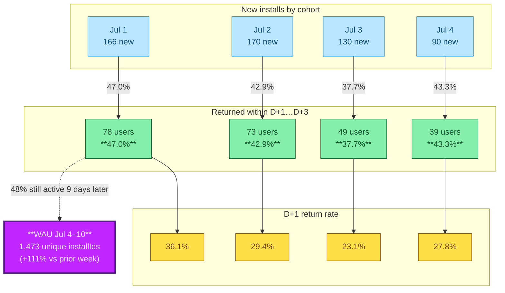

# Retention & Adoption Analysis (Aptabase `session_start` events)

**Period:** Jun 29 – Jul 10  
**Source:** Aptabase CSV exports of `session_start` events, joined on anonymous `installId` (not session ID).  
**Totals:** 8,590 events across 1,810 installs.

## Summary

Merged events showed **38–47%** of Jul 1–4 cohorts returned on another day within 3 days. WAU reached **1,473** unique installIds for Jul 4–10 (**+111%** vs the prior week). A sharp **Jul 9 spike** (398 new installs, 679 DAU) was observed alongside shifting adoption toward **grok-4.5** and strong engagement depth (**41.5%** multi-day users).

## Cohort retention table

| Cohort | New installs (first `session_start`) | Returned within D+1…D+3 | 3-day retention | D+1 return rate |
|--------|--------------------------------------|-------------------------|-----------------|-----------------|
| Jul 1  | 166                                  | 78                      | **47.0%**       | 36.1%           |
| Jul 2  | 170                                  | 73                      | **42.9%**       | 29.4%           |
| Jul 3  | 130                                  | 49                      | **37.7%**       | 23.1%           |
| Jul 4  | 90                                   | 39                      | **43.3%**       | 27.8%           |

## Retention diagram

## Key observations

- Short-term retention is healthy: mid-to-high 30s to mid-40s percent of new installs return within three days.
- The bulk of 3-day returns happens on D+1; D+2/D+3 add the remainder.
- For the Jul 1 cohort, 48% of the users who returned in the 3-day window were still active nine days later.
- WAU more than doubled week-over-week despite (or alongside) the Jul 9 spike.
- 41.5% multi-day users indicates good depth of engagement beyond one-off trials.
- Model mix continues shifting toward newer `grok-4.5` builds.

## Methodology

- **Cohort definition**: the calendar day of the *earliest* `session_start` for each distinct `installId`.
- **"Returned"**: at least one later `session_start` whose date is D+1, D+2, or D+3 relative to the cohort day.
- **WAU**: count of unique `installId`s that produced ≥1 `session_start` inside the Jul 4–10 window.
- **DAU / spikes**: derived from per-day unique `installId` counts in the exports.
- Only real user-initiated sessions are counted (the extension deliberately suppresses `session_start` for the hidden plan-mode primer and for primer-only/empty sessions).
- No client-side aggregation or retention math exists in the extension; this is purely post-hoc analysis of exported event CSVs.

## Related code & docs

- Event shape and guards: [src/telemetry.ts](../src/telemetry.ts)
- Privacy design & what is (not) sent: [docs/privacy.md](../docs/privacy.md)
- Probe that fires real events (to the dev project): [scripts/telemetry-probe.cjs](../scripts/telemetry-probe.cjs)
- Install ID generation & first-send gate: `src/sidebar.ts` (search `INSTALL_ID_KEY` and `isFirstSend`)

The extension's telemetry is intentionally minimal: one fire-and-forget `session_start` carrying only `installId` + `mode`/`model`/`effort` (plus standard system fields). Richer cohort or funnel analysis is performed offline on Aptabase exports.

---

*Analysis performed on merged CSV exports using `installId` as the user key. Numbers are as captured in the source data.*